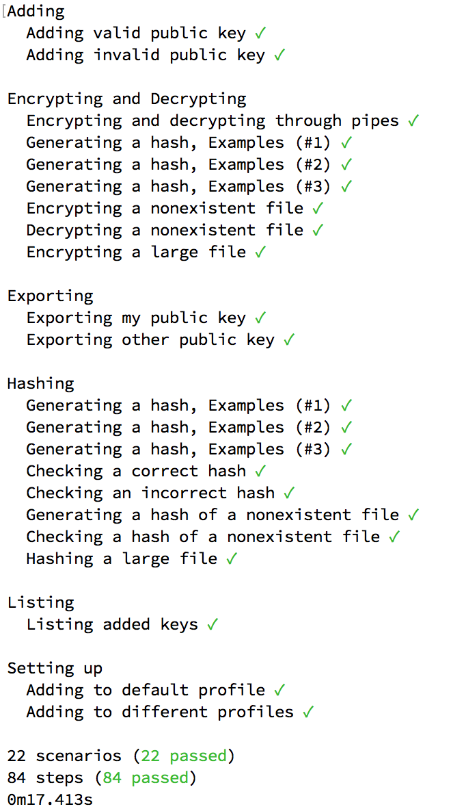
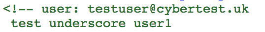
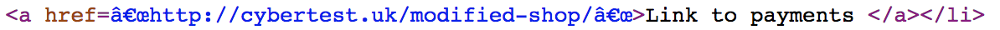
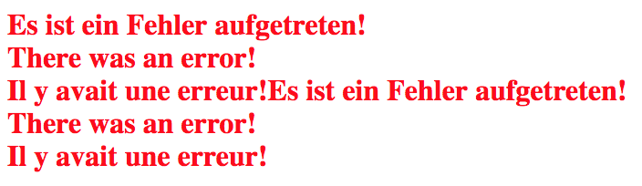
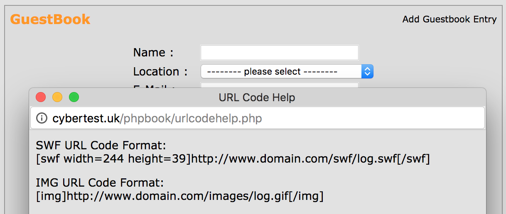
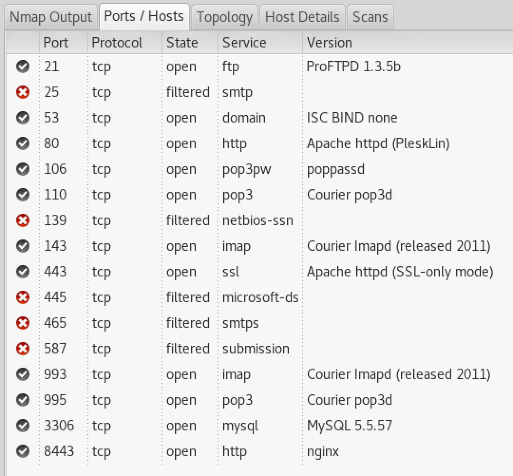
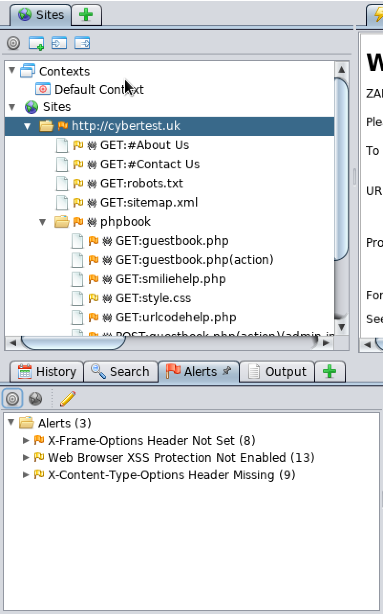

# Part 1

## Introduction

In this part of the practical the task was to implement a simple system for encrypting messages.

I decided to use libsodium for my system. My implementation is in Python, and I am using [PyNaCl](https://pynacl.readthedocs.io/en/latest/) for Python bindings for libsodium.

## Design

The program is used through the command line.

### Setting up

Before encrypting or decrypting any messages the system needs to be set up. To the user this is presented as setting their name. Internally this saves the user's name, generates a private and public asymmetric keys and stores these in the storage.

```
$ python -m crypto setup Alice
Hello Alice!
Your keys are now saved.
```

It is possible to set up the system using different profiles. This could be used for example to separate personal and work keys and messages.

```
$ python -m crypto --profile bob setup Bob
Hello Bob!
Your keys are now saved.
```

### Managing public keys

In order to be able to encrypt a message that only the recipient can decrypt, we need to obtain and remember their public key. Once we have it and we encrypt a message using the public key, only the recipient's private key can be used for decryption.

The system can store, list and export public keys.

To add someone else public keys, the `add` command can be used:

```
$ python -m crypto add Kevin kevin@example.com abc123
Added Kevin!
```

The public key uses PyNaCl's `HexEncoder`, which encodes the binary public key using the `binascii.hexlify` Python standard library function, which simply converts every byte of the data to a 2-digit hexadecimal number. I chose this format as it is easy to copy and paste and uses only standard alphanumeric characters.

After adding some keys, they can be listed using `list`: (public keys are trimmed to fit the page)

```
$ python -m crypto list
---------------------------------------------
| Name  | Email             | Public Key    |
---------------------------------------------
| Alice | alice@example.com | ee37ae149a... |
| John  | john@example.com  | 8548868765... |
---------------------------------------------
```

To export a single public key the `export` command can be used. It accepts an email address as an argument, and prints out just the public key for the specified person:

```
$ python -m crypto export john@example.com
85488687658562239d61881660ae27aec8ad0b9c1756697654aee0c6c7e3bc47
```

The export command can be also used to export the user's public key by not specifying any email address:

```
python -m crypto export
bc04ffec0bd77a8033b75d03dbfc79ae1743bea847b9edf8de161904e6fb486e
```

### Encrypting and decrypting

Once we have other people's public keys stored in the database, we can encrypt messages or files that only they will be able to decrypt using the `encrypt` command:

```
$ python -m crypto encrypt bob@example.com input.txt message.enc
```

This will read the file in `input.txt`, encrypt it using Bob's public key, and write the encrypted data into `message.enc`.

Bob can decrypt the file with the `decrypt` command:

```
python -m crypto decrypt alice@example.com message.enc output.txt
```

This will read the encrypted data in `message.enc`, decrypt it and put the result in `output.txt`. The sender has to be specified to be able to decrypt the file - it is not possible without their public key.

### Hashing

The system can calculate and check hashes of messages. To calculate the hash, we can use the `hash generate` command:

```
$ python -m crypto hash generate input.txt
2c9eabe7c88318810f1b29cf20382e1439c87241bf08ec54aa10ad2999e446ee
```

Once we have the hash, we can verify a file with `hash check`: (hash trimmed to fit the page)

```
$ python -m crypto hash check 2c9eabe7... input.txt
All good!

$ python -m crypto hash check 23480928... input.txt
Watch out, something is fishy here!
```

It is possible to specify the algorithm used for hashing:

```
$ python -m crypto hash generate --hasher sha256 input.txt
2c9eabe7c88318810f1b29cf20382e1439c87241bf08ec54aa10ad2999e446ee
```

The options are SHA256, SHA512 and BLAKE2b. If no algorithm is specified, BLAKE2b is used by default.

## Implementation

### Commands

For parsing the command line arguments I used the Python built-in `argparse` library. It allowed me to define commands and subcommands with their optional and required parameters. It is also able to generate a help message when the program is run with the `--help` parameter:

```
$ python -m crypto --help
```

Each command is stored in a separate file, which contains a `run` function. The function takes the parsed arguments as a parameter, and accesses the database, reads/writes files or uses PyNaCl to encrypt/decrypt messages or calculates hashes.

### Data storage

I used SQLite for storing public and private keys. The database has two tables - `people` and `me`.

`people` stores data about other people, with whom the user is exchanging encrypted messages. The table stores the person's name, email address and public key.

`me` stores data about the user. It contains the name and the private key.

This database is not encrypted, so if an attacker gained access to it, they would be able to extract the user's private key. An improvement to the system would be to encrypt the database using a passphrase, which would be then entered by the user when using the system, or optionally stored in the system's keychain.

I used the peeweee ORM library for using the database. This allowed me to simplify the program by not worrying about the SQL syntax and converting to and from database types.

I had to implement two new types of model fields, for private and public keys. These use the regular `char` database type and store the private/public key encoded as a hexadecimal value. When retrieving the data, the keys are decoded and converted into PyNaCl's `PrivateKey`/`PublicKey` instances.

### libsodium

I found libsodium to be extremely easy to use. The documentation for the Python bindings is well written and includes clear examples.

Boxes are used as an analogy for sending encrypted messages. A box is created using a private and public key. These are either sender's and receiver's, or vice versa. There are two methods for encrypting and decrypting messages.

For example, if Alice receives a message sent by Bob, she can decrypt it as shown below.

```
alice_sk = PrivateKey.generate()
bob_pk = get_bobs_key()

box = Box(alice_sk, bob_pk)
decrypted_message = box.decrypt(encrypted_message)
```

This analogy was enough to implement this system, since we are using asymmetric keys to encrypt messages that only the recipient can decrypt.

While I think that the library is very easy for simple systems like this one, it would be more difficult to apply it to more specialised systems.

For example, I haven't found a way to use a different algorithm for encryption/decryption, or how to change parameters of the used algorithms. Therefore my system supports only Curve25519 for generating keys and encrypting/decrypting messages.

## Testing

The program is tested with acceptance tests using [Cucumber](https://cucumber.io/) and [aruba](https://github.com/cucumber/aruba). Using these lets me define the behaviour of the whole program, including the command line inputs and output.

I did not use unit tests, as the whole program is a simple wrapper around libsodium and peewee. Both of these libraries have an extensive test suite.

The tests are written in Gherkin, which is a programming language designed to be readable by non-developers too. For example, the specification for the `setup` command is:

```
Feature: Setting up
  Scenario: Adding to default profile
    When I run `python -m crypto setup Alice`
    Then the output should contain "Hello Alice"

  Scenario: Adding to different profiles
    When I run `python -m crypto --profile alice setup Alice`
    Then the output should contain "Hello Alice"

    When I run `python -m crypto --profile bob setup Bob`
    Then the output should contain "Hello Bob"
```

Here we can see that the specification runs the program and then checks the output of it. The specification can also create temporary files to be used by the program:

```
Feature: Hashing
  Scenario: Checking a correct hash
    Given a file named "file.txt" with:
    """
    Hello, CS4203!
    """
    When I run `python -m crypto hash check ... file.txt`
    Then the output should contain "All good"
```

The instructions for running the test suite are in the README file.

Implemented test cases are:

- Adding a valid and invalid public key
- Encrypting and decrypting files of various types and sizes
    - JPEG images, text files, PDF files
- Encrypting and decrypting nonexistent files
- Exporting my public key
- Exporting others' public keys
- Generating a hash using different algorithms
- Generating a hash for large files
- Checking a correct hash
- Checking an incorrect hash
- Hashing and checking nonexistent files
- Listing added keys
- Setting up



# Part 2

In this part I used a browser to explore the website and its source code, and then various tools available in Kali Linux to do a more thorough analysis.

## Content analysis

I started the analysis by looking at the source of cybertest.uk.

The website is served through HTTP and not through HTTPS. I would say this is the most serious vulnerability on the website, especially since it is an e-shop. An attacker could perform a MITM attack and sniff out the user's credentials when logging in on the site, or steal the authentication cookie and use it to access the user's account. This problem is solved relatively easy, by setting up HTTPS on the website. In the past this required buying a certificate and setting it up, but today Let's Encrypt can be used to automatically obtain and update a free certificate.

The first potential vulnerability in the content is right at the start of the page: a CSS file is loaded from `http://www.w3schools.com`. HTTP is used instead of HTTPS, making it possible to perform a MITM attack and send a different stylesheet. Alternatively, the attacker could steal the w3schools.com domain once it expires and serve the stylesheet from their own server. The stylesheet could then execute arbitrary JavaScript code in some browsers, performing an XSS attack:

> As a little-known feature, some CSS implementations permit JavaScript code to be embedded in stylesheets. There are at least three ways to achieve this goal: by using the expression(...) directive, which gives the ability to evaluate arbitrary JavaScript statements and use their value as a CSS parameter [...] (@zalewski1)

More stylesheets are loaded from external domains, however these are more trustworthy (Google and Cloudflare). To mitigate this vulnerability all content, including JavaScripts, images and stylesheets should be loaded from the website domain, or some other trustworthy domain when using a CDN.

At the beginning of the `<body>` tag there is a button that shows the current date and time. This is implemented by the following JavaScript code:

```
document.getElementById('time').innerHTML = Date()
```

The use of `innerHTML` could be problematic if it used some other way to retrieve the data. For example, if user input would be used instead of the `Date()` function, an attacker could use this to inject malicious JavaScript code to the page, performing an XSS attack. The `textContent` property should be used instead, as it escapes HTML.

There seems to be some username and password included in the website comments (user: testuser@cybertest.uk, test underscore user1). This was probably left behind by the website administrator when setting up the site. If these are real credentials, it would be easy to check where it will work (SSH, FTP, website admin UI etc.). The credentials should be removed immediately and the password changed to a different, stronger one.



The page source contains URLs of three other pages on the same domain that appear to have dynamic content.

The first one is http://cybertest.uk/Server/AboutUs.asp, which while having the `.asp` extension used by ASP, shows only static content. The content in this case seems to be ASP source code, hinting that the server might be misconfigured and not serving dynamic pages correctly.

The second one is http://cybertest.uk/modified-shop/. This page shows alternately two types of errors - Internal Server Error with 500 HTTP response status code, and "There was an error!" with 503 HTTP status code. The source of these error pages does not show any vulnerabilities, however the internal server error message mentions the email ishbelduncan@hotmail.com. This could be used to direct an email phishing attack at the website administrator.





The last one is http://cybertest.uk/phpbook/guestbook.php, which contains a dynamic guestbook where visitor can add comments that are then displayed on the page.

Source of the guestbook does not show anything suspicious, however I have noticed one potential attack vector. It seems that it is possible to include a SWF file in the comments, and this file is then shown to all visitors.

SWF files can run Adobe Flash programs. Flash has been a source of many vulnerabilities and Adobe plans to stop updating and distributing it by the end of 2020 @adobeflash. Having the possibility of including any user-supplied Flash file is a large security risk as it lets attackers use the vulnerabilities to gain access to visitors' computers.



I would recommend disabling inserting SWF files in the guestbook.

I also tried to find the source code for the guestbook, but I was not able to, as the software seems to be very old and not accessible anymore.

## Network analysis

After analysing the content of the page, I focused on services other than the web server. For this I used `nmap` with the following options:

```
nmap -T3 -A -v cybertest.uk
```

This revealed multiple services running on the server: FTP, SMTP, IMAP, POP3, HTTP, HTTPS and MySQL. nmap also obtained the softwares and versions used, decribed below.

One interesting thing is that there is another HTTP server running on port 8443, that simply redirects to https://server.3-mountainsbansko.co.uk:8443. This domain is available to be registered - if http://cybertest.co.uk:8443 was used for something important, the attacker could register the 3-mountainsbansko.co.uk domain and serve malicious content from it.



I would recommend revising services running on the server and leaving only the most important ones running. Any other domains used by the system should not be let to expire.

Looking at the DNS records for cybertest.uk we can see that there is one MX record with value mail.cybertest.uk. This subdomain points to the same server as cybertest.uk, so the mail server is running on the same IP as the web server. There are also SPF (Sender Policy Framework) records that can be used to verify email messages sent from addresses using the cybertest.uk domain are actually sent from cybertest.uk.

Whois information tells us that the domain is registered by Ishbel Duncan - this could be useful for phishing attacks, where the attacker could pretend to be the website owner using the information from whois.

## Software analysis

Knowing which software is used and the exact versions can be very helpful for the attacker. Using that information they are able to find and exploit known vulnerabilities in the used software. Even if these are patched in the software, unless it is updated on the server, it is still vulnerable.

For example, I was able to find these:

- Apache, unknown version - web server
- PleskLin, unknown version - hosting control panel
- ProFTPD, version 1.3.5b - FTP server
- Courier POP3 and IMAP, unknown version - mail server
- MySQL, version 5.5.57 - database
- nginx, unknown version - web server
- PHP, version 5.3.3 - scripting language
- phpBook, version 1.50 - guestbook

We can focus on PHP - the 5.3.3 version was released on 22/7/2010. According to cvedetails.com there are 87 vulnerabilities for this version, with six of them having the highest score 10. For example, one of them, CVE-2015-4603, "allows remote attackers to execute arbitrary code via an unexpected data type".

I would recommend always having up-to-date software installed on the server, and allowing access to only necessary services. In this case, it is likely that the MySQL server does not require external access and should be accessible only locally.

## Automated analysis

Finally, I tried to use vulnerability scanning tools to find other attack vectors.

First, I tried to use OWASP ZAP to analyse the content on cybertest.uk. It only showed alerts about missing security-related headers. These are `X-Frame-Options`, `X-XSS-Protection` and `X-Content-Type-Options`.

`X-Frame-Options` specifies whether the page can be loaded in an `<iframe>` tag inside another page. Disallowing this will for example prevent the attacker from including the e-shop checkout page on another page, overlaying it with other elements, showing only the "purchase" button, and misleading the user.

`X-XSS-Protection` enables or disables XSS filter in some browsers. This filter tries to mitigate XSS attacks by detecting when malicious JavaScript code has been injected into a website.

`X-Content-Type-Options` prevents MIME confusion attacks by forcing the browser to respect the value of the `Content-Type` header for JavaScript and CSS files and not using sniffing to guess the content type.



I also ran OpenVAS using the built-in wizard. The scanning took over 40 minutes and it found 117 vulnerabilities, but only 13 of then had Quality of Detection more than 70% (Quality of Detection is a measure for how reliable the vulnerability detection is). All of these had medium severity.

One vulnerability is that the HTTPS server on port 443 allows vulnerable cipher suites. The attacks on these ciphers are known as Sweet32. Other vulnerabilities are related - weak cipher suites are allowed on the same HTTPS server, deprecated SSL protocol detection and insufficient group strength in Diffie-Hellman key-exchange.

Finally, I tried to use DMitry to find out more information about the website, however it did not find any new subdomains or email addresses.

Overall I found these tools very easy to use. All of them had a simple "enter URL here" field that performs a comprehensive scan. The results were easy to understand and each vulnerability had a description. OpenVAS even includes links to the CVE database for found vulnerabilities.

# Conclusion

In the first part of this practical I used the PyNaCl library to implement a simple system for encrypted communication between two people. The system is able to manage public and private keys, encrypt and decrypt messages, and check the integrity of a file.

In the second part I conducted a security analysis of the cybertest.uk website. The analysis showed a number of flaws, from minor things such as missing security headers and broken links, to a relatively major problem, where an attacker is able to upload arbitrary SWF files to the website. I also scanned the server hosting the website and found a number of other services, such as a MySQL database, FTP, IMAP and SMTP servers.

While doing this practical I learned more about crypto libraries, and the tools used for security analysis.
